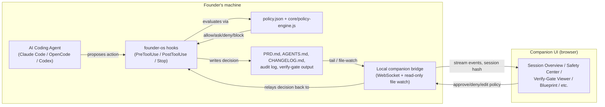
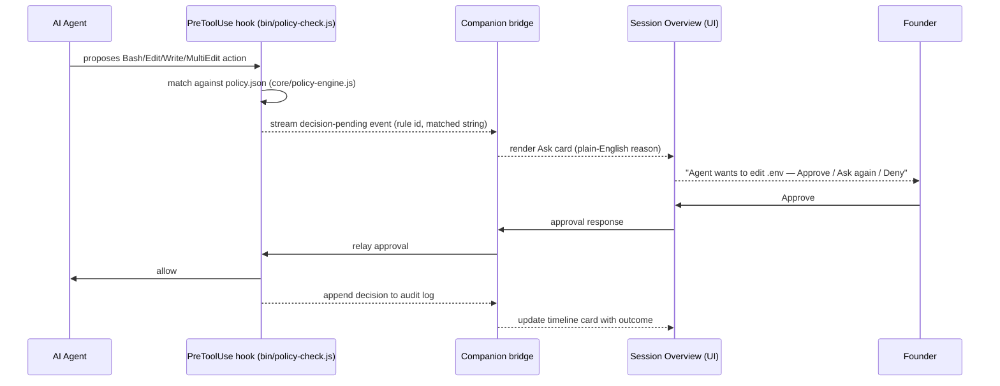
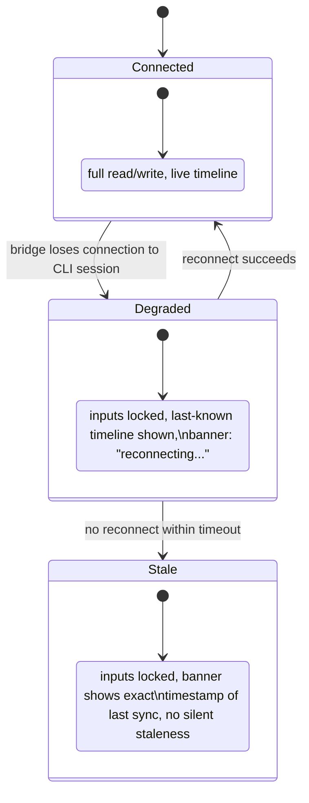
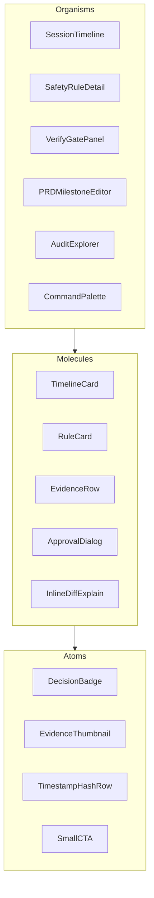
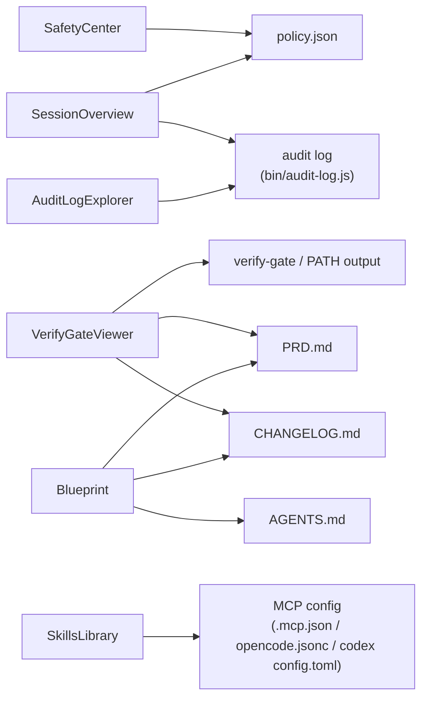

# Architecture: Companion UI over an Authoritative CLI Session

The single hardest constraint on this whole proposal: **the CLI/agent
session is the real engine; the companion UI is a window onto it.** Every
diagram below exists to answer one question — how does a browser tab stay
honest about a terminal session it doesn't control?

## System context

Key property this diagram is meant to enforce: **the bridge only ever
relays and streams — it never becomes an independent source of truth.**
Any UI action (approve, deny, edit a policy rule) is sent back through the
bridge to the same hook/policy machinery the CLI already uses, so there is
exactly one place a decision is actually enforced.

## Decision/approval data flow (a single intervention, end to end)

If the bridge is unreachable at any point in this sequence, the hook still
behaves exactly as it does today with no UI attached — the founder falls
back to answering the prompt in the terminal itself. The UI is additive,
never a required link in the safety chain.

## Session-authority / offline handling

## Component-tier architecture (maps to `COMPONENT-INVENTORY.md`)

## Per-screen artifact dependency map

This is the same reads/writes information as `SRS.md`, laid out as a
single map so a build-order discussion can see all the file-level
coupling at once:

## Explicit non-goals of this architecture

- **Not a second policy engine.** The UI never evaluates a rule itself;
  it only renders decisions `core/policy-engine.js` already made and
  relays human responses back to it.
- **Not a replacement for the CLI.** Every screen that shows an action
  provides an "Open in CLI" escape hatch; nothing in this UI should ever
  be the *only* way to do something founder-os already supports from the
  terminal.
- **Not a multi-tenant SaaS backend (yet).** This architecture describes a
  single Solo Builder's local project bridged to a browser tab — not a
  hosted, multi-project account system, and not a shared/multi-founder
  session. That would be a separate, later proposal.
